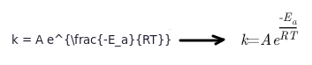
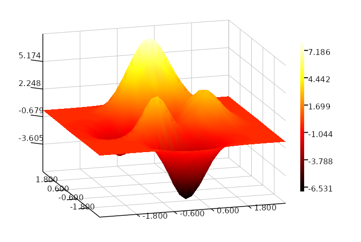
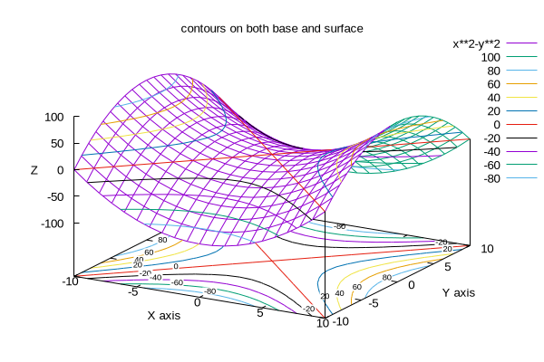
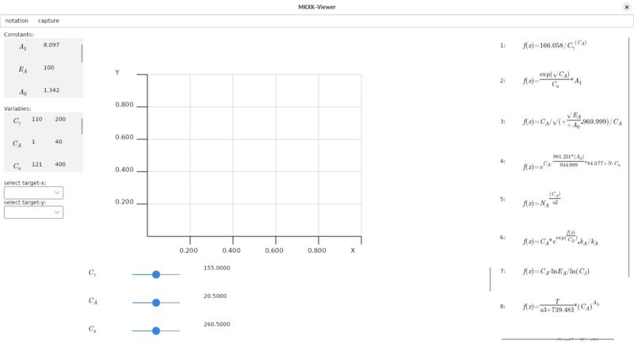
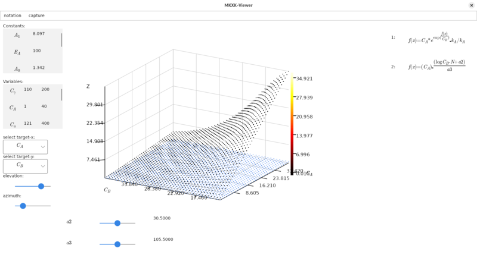

This `.sln` contains a collection of `.fsproj`.   

- Notation
- SKCharts
- MKXK
- MKXK-Viewer

**P.S.** In general the .fsproj directory contain `\tests` subdirectories with .fsx scritps.   
Those scripts are used both as tests, that things did not break during development,  
and as **examples**.   


### Notation

A very plain library for parsing simple LaTeX string of mathematical formulas and by leveraging   
SkiaSharp, it writes .png images of those notations over some Stream.   



On top of that, it also contains a demo app in `tests/viewnotation_test.fsx` script.

### SKCharts

A simple charting library, it supports 2d charts and 3d surfaces. It is implemented with SkiaSharp and   
draws on a SKCanvas, which means it can be used wherever a SKSurface is available.   
It also contains an implenetation for AvaloniaUI as a AvaloniaControl.   
On top of that, as in the case on `Notation.fsproj` it could potential be compiled   
AoT, and by using `[<NativeCallersOnly>]` (look at src/Notation/README.md) be called  
from other languages outside of dotnet. 



### MKXK

A library that parses LaTeX mathematical formulas, it creates ASTs (abstract syntax trees) and can    
evaluate those trees numerically. It can also create random AST. This library is meant as a symbolic   
regression project. However, it also contains other helpful utilities as `MKXK/src/Gnuplot.fs` which  
is a simple class for easily integrating Gnuplot from F# code.    
Its purpose is to help with modeling processes (as in some laboratory experiments), as a tool.  

```
let gnu4 = Gnuplot("tests_output/images/image4.png")
gnu4
|>> "set terminal pngcairo  transparent enhanced font 'arial,10' fontscale 1.0 size 600, 400 "
|>> "set key at screen 1, 0.9 right top vertical Right noreverse enhanced autotitle nobox"
|>> "set style textbox  opaque margins  0.5,  0.5 fc  bgnd noborder linewidth  1.0"
|>> "set view 60, 30, 1, 1.1"
|>> "set samples 20, 20"
|>> "set isosamples 21, 21"
|>> "set hidden3d back offset 1 trianglepattern 3 undefined 1 altdiagonal bentover"
|>> "set contour both"
|>> "set cntrlabel  format '%8.3g' font ',7' start 5 interval 20"
|>> "set cntrparam levels 10"
|>> "set style data lines"
|>> "set title 'contours on both base and surface' "
|>> "set xlabel 'X axis' "
|>> "set xrange [ * : * ] noreverse writeback"
|>> "set x2range [ * : * ] noreverse writeback"
|>> "set ylabel 'Y axis' "
|>> "set yrange [ * : * ] noreverse writeback"
|>> "set y2range [ * : * ] noreverse writeback"
|>> "set zlabel 'Z ' "
|>> "set zlabel  offset character 1, 0, 0 font '' textcolor lt -1 norotate"
|>> "set zrange [ * : * ] noreverse writeback"
|>> "set cbrange [ * : * ] noreverse writeback"
|>> "set rrange [ * : * ] noreverse writeback"
|>> "set colorbox vertical origin screen 0.9, 0.2 size screen 0.05, 0.6 front  noinvert bdefault"
|>> "NO_ANIMATION = 1"
|>> "splot x**2-y**2 with lines, x**2-y**2 with labels boxed notitle"
|> Gnuplot.run
```



### MKXK-Viewer

It references all the aforementioned .fsproj, in order to deliver a visualization tool of the ASTs   
and to dynamically affect the functions-formulas-ASTs. It is mostly a phase diagram, that supports both  
2D charts and 3D surfaces on the generated ASTs, that can interchange based the selected variables to  
evaluate against. On top of that it integrates the mathematical notation of those ASTs   
(with the Notation.fsproj). That combination provides a better UX.   




By selecting **X-variable** and **Y-variable** in the Comboboxes on the left, the   
formulas on the right side are filtered recarding they contain these x,y variables   
and are rendered either as 2d chart, or 3d plane whether is set just the first Combobox   
or both Comboboxes.




For more information, check the `README.md` of each project.  

**P.S.** In every .fsproj directory there is a `tests\` folder containing examples and showcasing  
the API. More details can be found there.   
